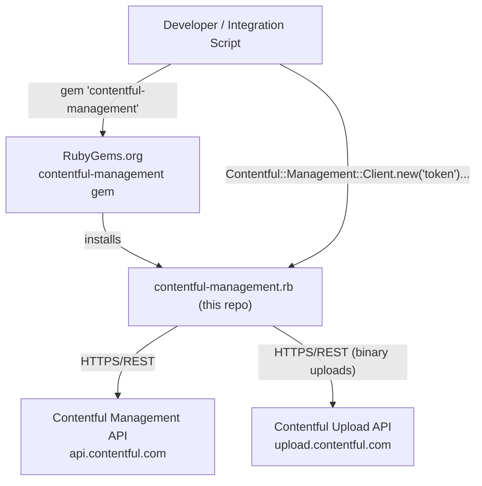

# Architecture

<!-- Generated by seed-golden-context | Last updated: 2026-05-05 -->

## Overview

`contentful-management.rb` is the official Ruby client for the [Contentful Management API (CMA)](https://www.contentful.com/developers/docs/references/content-management-api/). It wraps every CMA endpoint in a Rubyish interface — managing spaces, environments, content types, entries, assets, webhooks, roles, API keys, taxonomy concepts, and more. The library handles authentication, serialization, rate-limiting with retry, and optionally caches content type schemas into `DynamicEntry` classes so callers get typed field accessors on entries.

## System Context



**Upstream (consumes):**
- Contentful Management API (`api.(eu.)contentful.com`) — all read/write operations
- Contentful Upload API (`upload.(eu.)contentful.com`) — binary asset uploads

**Downstream (consumes this repo):**
- Any Ruby script, app, or integration requiring programmatic Contentful content management

## Internal Structure

| Path | Purpose |
|---|---|
| `lib/contentful/management/client.rb` | Entry point. `Client` class holds config, exposes all `*MethodsFactory` accessors, handles HTTP execution, rate-limit retry, and dynamic entry cache management. |
| `lib/contentful/management/client_*_methods_factory.rb` | One factory module per resource type (e.g., `ClientEntryMethodsFactory`). Provide `all`, `find`, `create` scoped to `space_id` / `environment_id`. Inherit from `ClientAssociationMethodsFactory`. |
| `lib/contentful/management/client_association_methods_factory.rb` | Base factory mixin — generic `all`, `find`, `create`, `new`. Uses `associated_class` (inferred from the factory's own class name) to dispatch to the resource class. |
| `lib/contentful/management/resource.rb` | Base `Resource` module. Handles `sys` block, property coercions, YARD-documented CRUD lifecycle (`update`, `destroy`, `reload`). Mixed into every resource class. |
| `lib/contentful/management/resource/publisher.rb` | `Publisher` mixin — `publish`, `unpublish`, `published?`, `updated?`. Included by `Entry`, `Asset`, `ContentType`. |
| `lib/contentful/management/resource/archiver.rb` | `Archiver` mixin — `archive`, `unarchive`, `archived?`. Included by `Entry`, `Asset`. |
| `lib/contentful/management/resource/system_properties.rb` | `SystemProperties` mixin — maps `sys` block to Ruby accessors (`id`, `type`, `version`, `space`, `environment`, etc.). |
| `lib/contentful/management/resource_builder.rb` | Parses API JSON into typed Ruby objects. Uses `DEFAULT_RESOURCE_MAPPING` (`sys.type` → class). Handles `DynamicEntry` lookup and link resolution within response payloads. |
| `lib/contentful/management/resource_requester.rb` | Makes HTTP calls via `Client#execute_request`. Handles `get`, `post`, `put`, `delete`, `publish`, `unpublish`, `archive`, `unarchive` verbs. |
| `lib/contentful/management/request.rb` | Encapsulates a single HTTP request — URL, query, headers, body. |
| `lib/contentful/management/response.rb` | Wraps an HTTP response — parses status, extracts error message, surfaces raw body. |
| `lib/contentful/management/dynamic_entry.rb` | `DynamicEntry` factory — creates per-content-type `Entry` subclasses with typed field accessors generated from the content type schema. Cached on `Client#dynamic_entry_cache`. |
| `lib/contentful/management/<resource>.rb` | One file per CMA resource type: `entry.rb`, `asset.rb`, `space.rb`, `environment.rb`, `content_type.rb`, etc. |
| `lib/contentful/management/error.rb` | Error class hierarchy: `Error` → `BadRequest`, `Unauthorized`, `AccessDenied`, `NotFound`, `Conflict`, `UnprocessableEntity`, `RateLimitExceeded`, `ServerError`, etc. |
| `lib/contentful/management/support.rb` | Utility helpers — URL helpers, camelCase/snake_case conversion. |
| `spec/` | RSpec test suite, mirroring `lib/` structure. HTTP mocked with VCR cassettes in `spec/fixtures/`. |
| `examples/` | Usage examples including custom class mapping and resource mapping. |
| `lib/contentful/management/version.rb` | Contains `VERSION` constant — bump for every release |
| `spec/fixtures/` | VCR cassette YAML files. Do not fabricate or hand-edit cassettes — re-record against the real API if API response shapes change |
| `.rubocop_todo.yml` | Auto-generated RuboCop todo list — regenerate with `bundle exec rubocop --auto-gen-config`, do not hand-edit |

## Data Flow

```
Developer code
  │
  ▼
Client.new('token').entries('space_id', 'env_id')     # returns ClientEntryMethodsFactory
  │
  ▼
ClientEntryMethodsFactory#all(params)                  # calls Entry.all(client, space_id, env_id, params)
  │
  ▼
ResourceRequester#get → Client#execute_request         # builds Request, fires HTTP via `http` gem
  │
  ▼
HTTP 200 JSON response
  │
  ▼
Response.new(raw_response, request)                    # wraps and parses status
  │
  ▼
ResourceBuilder#run                                    # dispatches via DEFAULT_RESOURCE_MAPPING
  │
  ▼
Array of Entry objects (or DynamicEntry subclass if in cache)
  with .publish, .update, .destroy, .sys, .fields, etc.
```

**Dynamic entry flow:**
If `dynamic_entries: { 'space_id' => 'env_id' }` is passed at `Client` init, the client fetches all content types for that environment and builds `DynamicEntry` subclasses with per-field Ruby method accessors. These are cached in `Client#dynamic_entry_cache` and used automatically by `ResourceBuilder` when deserializing entries.

**Rate-limit retry flow:**
`Client#execute_request` rescues `RateLimitExceeded` (HTTP 429), reads `x-contentful-ratelimit-reset` header, sleeps with jitter (1.0–1.2× reset time), and retries up to `max_rate_limit_retries` times (default: 1).

**Thread safety note:**
The client stores itself in `Thread.current[:client]` at initialization. Multiple threads should use separate client instances.

## Domain Concepts

| Concept | Description |
|---|---|
| **Space** | Top-level organizational unit — contains environments, API keys, webhooks, roles. |
| **Environment** | A named branch within a space (e.g., `master`, `staging`). ContentTypes, Entries, Assets, and Locales are environment-scoped. |
| **Content Type** | Schema definition. Defines fields and types. Must be published before entries reference it. |
| **Entry** | A single content item. Lifecycle: Draft → Published → Archived. `Entry` has typed field accessors when DynamicEntry is used. |
| **DynamicEntry** | Auto-generated `Entry` subclass with named field methods (e.g., `entry.title` instead of `entry.fields[:title]`). Built from content type schema at client init. |
| **Asset** | Binary file (image, video, PDF). Two-step lifecycle: create → process → publish. |
| **Snapshot** | Immutable historical copy of an entry or content type at a specific version. |
| **Tag** | Metadata tag for organizational filtering on entries/assets. |
| **Taxonomy Concept / Concept Scheme** | Hierarchical controlled vocabulary (SKOS-based). Organization-scoped, not space/environment-scoped. Added in v3.12.0. |
| **sys** | Every resource has a `sys` hash: `id`, `type`, `version`, `createdAt`, `updatedAt`, `publishedAt`, `archivedAt`, `space`, `environment`. |

**Version management:** All mutating operations (update, publish, archive, delete) pass `sys[:version]` in the request header. Mismatch returns HTTP 409 `Conflict`.

## Key Dependencies

| Dependency | Why |
|---|---|
| `http` (~> 5.0) | HTTP client for all CMA API calls. Replaces earlier versions of the gem; bumped through major versions as the project matured. |
| `multi_json` (~> 1.15) | JSON parsing with automatic adapter selection (yajl, oj, json gem). Provides consistent JSON behavior across Ruby environments. |
| `json` (>= 1.8, < 3.0) | JSON gem as a direct dependency for environments where `multi_json` falls through. |
| `rspec` (~> 3) | Test framework. |
| `vcr` (~> 6.2.0) | Records/replays HTTP interactions as cassette fixtures for deterministic offline tests. |
| `webmock` | HTTP request stubbing used alongside VCR. |
| `rubocop` (~> 1.56.2) | Linter. Config in `.rubocop.yml` + `.rubocop_todo.yml`. |
| `simplecov` | Test coverage reporting. |
| `guard` + `guard-rspec` + `guard-rubocop` | File-watcher dev loop (run tests and lint on file changes). Config in `Guardfile`. |

## Configuration

All configuration is passed as a Hash to `Client.new('token', configuration)`. No environment variables are read by the library.

| Parameter | Purpose | Default |
|---|---|---|
| `api_url` | CMA base URL | `api.contentful.com` |
| `uploads_url` | Upload API base URL | `upload.contentful.com` |
| `api_version` | CMA API version | `'1'` |
| `secure` | Use HTTPS | `true` |
| `default_locale` | Default locale for fields | `'en-US'` |
| `gzip_encoded` | Accept gzip responses | `false` |
| `logger` | `::Logger` instance or `false` | `false` |
| `log_level` | Logger level | `Logger::INFO` |
| `raise_errors` | Raise errors vs return error objects | `false` |
| `dynamic_entries` | Hash of `space_id => environment_id` to pre-cache DynamicEntries at init | `{}` |
| `disable_content_type_caching` | Skip DynamicEntry cache population | `false` |
| `proxy_host` / `proxy_port` / `proxy_username` / `proxy_password` | HTTP proxy config | `nil` |
| `max_rate_limit_retries` | Max 429 retries before raising | `1` |
| `max_rate_limit_wait` | Max seconds to wait for rate limit reset | `60` |
| `application_name` / `application_version` | Injected into `X-Contentful-User-Agent` | `nil` |
| `integration_name` / `integration_version` | Integration metadata for user-agent | `nil` |

**Notable difference from other SDKs:** `raise_errors` defaults to `false` — errors are returned as `Contentful::Management::Error` objects rather than raised, unless explicitly set.

## Operational Knowledge

### Failure Modes

| Failure | Symptom | Resolution |
|---|---|---|
| `Conflict` (HTTP 409) | Raised on update/publish/delete | Re-fetch the resource to get the latest `sys[:version]` |
| `RateLimitExceeded` (HTTP 429) | Retries exhausted | Increase `max_rate_limit_retries` or `max_rate_limit_wait` |
| `Unauthorized` (HTTP 401) | Access token invalid/expired | Rotate the management token |
| `AccessDenied` (HTTP 403) | Token lacks permission | Check space/org permissions for the token |
| `NotFound` (HTTP 404) | Wrong space/env/resource ID | Verify IDs |
| Error objects returned silently | `raise_errors: false` (default) — errors returned, not raised | Set `raise_errors: true` or always check `response.is_a?(Contentful::Management::Error)` |
| Stale DynamicEntry cache | Content type fields changed after client init | Call `client.update_dynamic_entry_cache_for_environment!(env)` or reinitialize the client |
